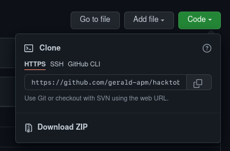
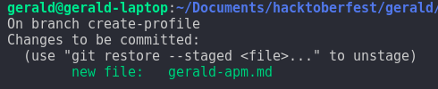

# Hacktoberfest Introduction on UKM-ITC Trunojoyo

Repository for introducing the Hacktoberfest Event to learn about contributing to open-source projects through GitHub.

## Frequently Asked Questions

**Is this data collection?**

No, this is only for learning purpose about git flow and open source contribution process.

**Do I need to attach my real identity?**

No, just put any data. We just want to learn about open source contributions.

**Do it on your own risk!**

We don't collecting the data, but there is chance for other people abuse your data that submitted here. Please do it with your own risk, **we don't protect your data**.

## Step by step to contribute into this repository

Here is a way to contribute to this repository. Please enjoy 😀

### Fork repo to your repository

The first step is to create a **fork** of this repo. clicking on the **fork** button on the top of this page. A fork is basically your own working copy of this repository.


### Clone forked repo to your machine

The next step is to clone the forked repo to your machine.
Go to your GitHub repositories and open the forked repository called hacktoberfest-intro (_forked from cangkrukan-klas/hacktoberfest-intro_). Then click on the "Clone or download" button and then click the copy to clipboard icon to get your URL.



Finally, run the following git command in your terminal:

```sh
git clone "the copied url"
```

For example:

```sh
git clone https://github.com/gerald-apm/hacktoberfest-intro.git
```

There you have it! You just created a local copy of forked repository on you computer. Good job!

### Create Branch In Local Computer

It is common practice to have a new branch for each new feature or bug-fixes that you are working on. Let's go ahead and create one.

If you have not created the branch yet, start by changing your directory to the directory that was created when you run git clone:

```sh
cd hacktoberfest-intro
```

Create new branch for working by running this command.

```sh
git checkout -b <your-new-branch-name>
```

> Note: Replace `your-new-branch-name` with something that you are about to work on, i.e.

```sh
git checkout -b create-profile
```

### Add your profile.md

Add your first file with the name `profile-[username].md` on the `contributors/` directory in that branch.

> Note: Replace `[username]` with your github username, i.e.  `profile-geraldapm.md`

add your profile in `profile-[username].md` with syntax

```md
# <username> profile
s
* name : 'xxx',
* github : 'xxx',
* email : 'xxx@xxx.com',
* quotes : 'lorem ipsum sit dolor amet'
```
> Note: Replace `[username]` with your github username, i.e.  `geraldapm profile`


### Add entry to Contributors.md

Now open `Contributors.md` file in a text editor, add your name to it. Don't add it at the beginning or end of the file. Put it anywhere in between. Now, save the file.


If you go to the project directory and execute the command `git status`, you'll see there are changes.

### Committing your changes

Run `git status` to see which changes you have made. This will look something like:


Add these changes to your next commit by running:

```sh
git add .
```

To commit your changes, run:

```sh
git commit -m "Your message"
```

For example:

```sh
git commit -m "added Gerald to contributors list"
```

### Push your changes to Github

Push your changes to GitHub by running:

```sh
git push origin <your-new-branch-name>
```

> Note: Replace `<your-new-branch-name>` with the name of your branch

For example:

```sh
git push origin create-profile
```

This will look something like:


## Open a Pull Request

Head over to your repository on GitHub and click on the green "Compare and pull request" button.


Describe your changes and submit your pull request


-----

## License

Licensed under the MIT License.

-----